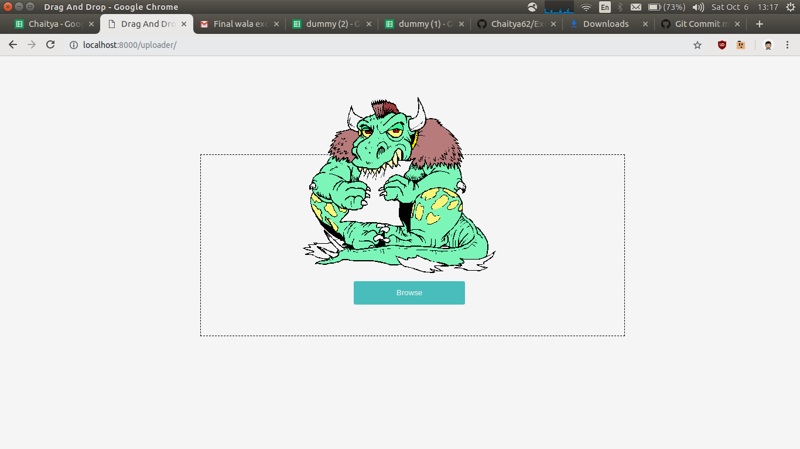
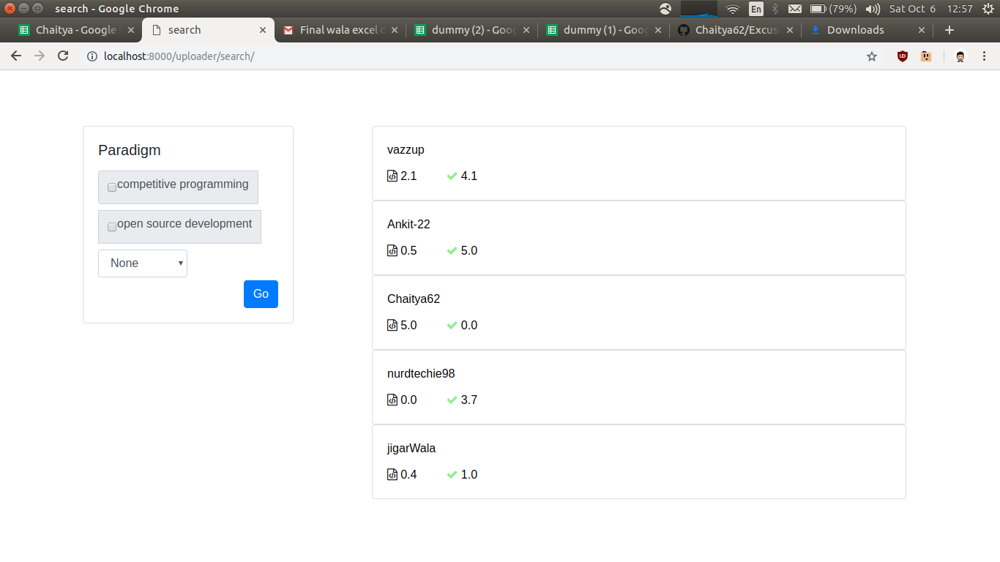
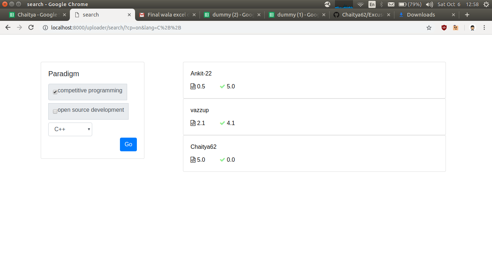
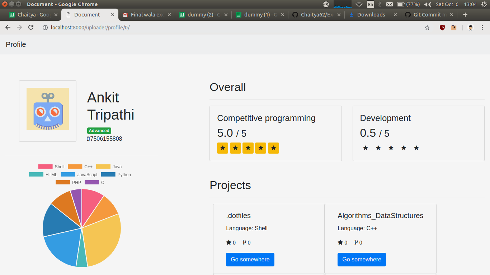
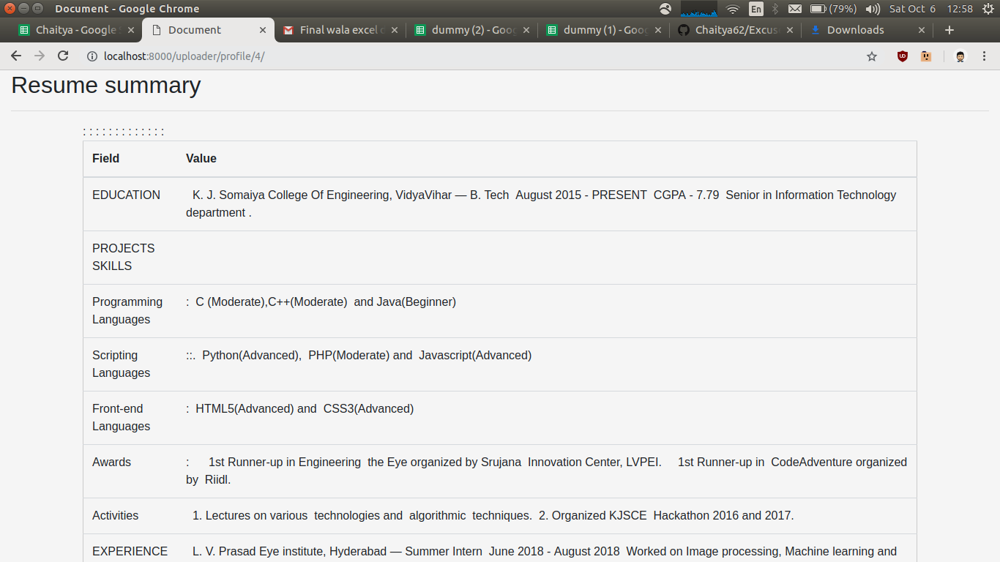

<p align="center">
  <a href="" rel="noopener">
 </a>
</p>

<h3 align="center">ResCrunch</h3>

<div align="center">

[](https://www.python.org/)
<br>

</div>

---

Tedious job of screening process for any event. We provide a solution where event organizer will be able to categories/priorities the candidates with minimum human intervention.

<div align="center">
&#10077; “Automation is cost cutting by tightening the corners and not cutting them.” &#10078;  -  Haresh Sippy

</div>

---

### Features

- Upload excel workbook containing resume and other metadata (excel can generated from google form filled by different applicants)
- Summarize resume of any format.
- Rate candidates according our unique algorithm based on 2 parameters viz.
  * Competitive Programming (problems solved, correct answers, ratings etc.)
  * Open Source Development (commits,stars , followers, repository, years of experience etc.)
- Visualization of different repository and different repository.
- Search for the candidate based on above parameters and also languages they have worked on in their open source development.


###  Screenshots


<div align="center">

<h3 > Web-App  </h3>
<br>


<p align="center">
  <a href="" rel="noopener">
 </a>
</p>


<p align="center">
  <a href="" rel="noopener">
 </a>
</p>


<p align="center">
  <a href="" rel="noopener">
 </a>
</p>


<p align="center">
  <a href="" rel="noopener">
 </a>
</p>


<p align="center">
  <a href="" rel="noopener">
 </a>
</p>


</div>
---

### Installation

- Clone the repo and install the dependencies.

```sh
        $ git clone https://github.com/Chaitya62/ExcusemeWTF.git
        $ cd event_management
        $ pip3 install -r requirements.txt
```

---

### Note

- This repository / project was a part of **KJSCE Hackathon 2018**, was done under `24 hours with minimal pre-preparation`

---

### Contributors

- [@Chaitya62](https://github.com/chaitya62)
- [@Ankit-22](https://github.com/Ankit-22)
- [@JigarWala](https://github.com/JigarWala)


### References
Image taken from [here](http://www.clipartpanda.com/clipart_images/clip-art-of-a-monster-eating-8838031)
